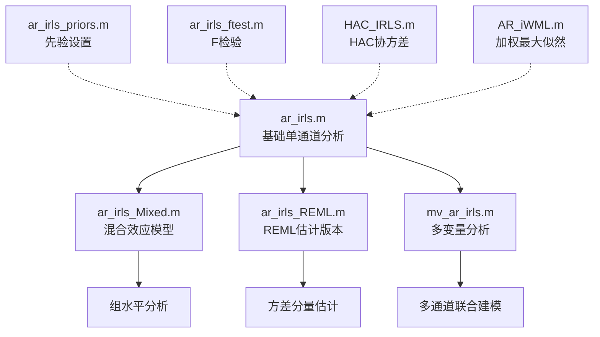
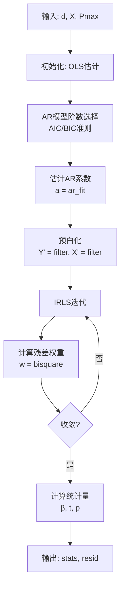

# 📊 NIRS-Toolbox AR-IRLS 数学模块说明文档

**生成日期**: 2026-01-27  
**模块位置**: `+nirs/+math/`  
**核心论文**: http://www.ncbi.nlm.nih.gov/pmc/articles/PMC3756568/

---

## 📑 目录

1. [核心概念](#核心概念)
2. [模块架构](#模块架构)
3. [核心函数详解](#核心函数详解)
4. [使用指南](#使用指南)
5. [参数说明](#参数说明)
6. [常见问题](#常见问题)
7. [最佳实践](#最佳实践)

---

## 🎯 核心概念

### 什么是 AR-IRLS？

**AR-IRLS** = **Autoregressive Iteratively Reweighted Least Squares**

- **AR (Autoregressive)**: 自回归模型，用于建模时间序列的自相关结构
- **IRLS (Iteratively Reweighted Least Squares)**: 迭代重加权最小二乘，用于稳健回归（抗离群值）

### 为什么需要 AR-IRLS？

fNIRS 数据面临两大挑战：

1. **时间自相关** → 违反GLM独立性假设 → 统计推断错误
2. **运动伪迹** → 离群值污染数据 → 影响参数估计

**AR-IRLS 解决方案**：
- **AR模型** → 白化残差，处理自相关
- **IRLS** → 稳健估计，抗运动伪迹

---

## 🏗️ 模块架构

### 核心函数家族



### 文件清单

| 文件名 | 功能 | 使用场景 |
|--------|------|---------|
| **ar_irls.m** | 核心AR-IRLS实现 | 单被试GLM分析 |
| **ar_irls_Mixed.m** | 混合效应模型 | 多被试组分析 |
| **ar_irls_REML.m** | REML估计版本 | 需要方差分量估计 |
| **mv_ar_irls.m** | 多变量AR-IRLS | 多通道联合建模 |
| **ar_irls_priors.m** | 贝叶斯先验 | 添加先验信息 |
| **ar_irls_ftest.m** | F统计检验 | 对比分析 |
| **HAC_IRLS.m** | HAC协方差估计 | 异方差自相关一致性 |
| **AR_iWML.m** | 加权最大似然 | 替代IRLS |

---

## 📖 核心函数详解

### 1. `ar_irls.m` - 核心函数 ⭐⭐⭐⭐⭐

#### 函数签名
```matlab
[stats, resid] = ar_irls(d, X, Pmax, tune, nosearch, useGPU, singlePrecision)
```

#### 输入参数

| 参数 | 类型 | 说明 | 默认值 |
|------|------|------|--------|
| **d** | `[T×C]` | 数据矩阵（T=时间点，C=通道数） | 必需 |
| **X** | `[T×K]` | 设计矩阵（K=回归系数数量） | 必需 |
| **Pmax** | `scalar` | 最大AR模型阶数 | 必需 |
| **tune** | `scalar` | Tukey's bisquare调优常数 | 4.685 |
| **nosearch** | `logical` | 是否跳过模型阶数搜索 | false |
| **useGPU** | `logical` | 是否使用GPU加速 | false |
| **singlePrecision** | `logical` | 是否使用单精度 | false |

#### 输出结果

```matlab
stats 结构体包含：
    .beta    [K×C]  - 回归系数（β）
    .tstat   [K×C]  - t统计量
    .pval    [K×C]  - 双侧p值
    .ppos    [K×C]  - 单侧p值（正向）
    .pneg    [K×C]  - 单侧p值（负向）
    .P       [C×1]  - 每个通道的AR模型阶数
    .w       [T×C]  - IRLS权重
    .dfe     scalar - 自由度
    .covb    [K×K×C] - 协方差矩阵
    .a       {C×1}  - AR系数
```

#### 核心算法流程



#### 关键特性

1. **自适应AR阶数**: 自动选择最优P（基于AIC）
2. **稳健权重**: Tukey's bisquare函数下权重异常值
3. **白化处理**: AR滤波器预白化数据
4. **逐通道处理**: 每个通道独立建模

---

### 2. `ar_irls_Mixed.m` - 混合效应模型 ⭐⭐⭐⭐

#### 函数签名
```matlab
stats = ar_irls_Mixed(d, X, Z, Pmax, tune)
```

#### 输入参数

| 参数 | 类型 | 说明 |
|------|------|------|
| **d** | `[T×C]` | 数据矩阵 |
| **X** | `[T×K]` | 固定效应设计矩阵 |
| **Z** | `[T×R]` | 随机效应设计矩阵 |
| **Pmax** | `scalar` | 最大AR阶数 |
| **tune** | `scalar` | 调优常数（默认4.685） |

#### 与 ar_irls 的区别

| 特性 | ar_irls | ar_irls_Mixed |
|------|---------|---------------|
| **模型类型** | 固定效应 | 混合效应 |
| **适用场景** | 单被试分析 | 多被试组分析 |
| **随机效应** | 不支持 | 支持（Z矩阵） |
| **组间差异** | 不建模 | 建模为随机效应 |

#### 使用场景

```matlab
% 组分析示例
% X: 固定效应（条件、时间等）
% Z: 随机效应（被试、区组等）

X = [ones(n,1), condition];  % 固定效应
Z = kron(eye(nSubjects), ones(nTrials,1));  % 随机效应（被试）

stats = nirs.math.ar_irls_Mixed(data, X, Z, Pmax, 4.685);
```

---

### 3. `mv_ar_irls.m` - 多变量AR-IRLS ⭐⭐⭐⭐

#### 函数签名
```matlab
stats = mv_ar_irls(X, Y, Pmax)
```

#### 核心思想

**单变量 AR-IRLS**: 每个通道独立建模  
**多变量 AR-IRLS**: 多个通道联合建模（考虑通道间相关性）

#### 算法流程

```
1. 初始化: 逐通道独立 ar_irls
2. 迭代:
   a. 估计残差的多变量AR模型（VAR）
   b. 用VAR模型预白化所有通道
   c. 重新估计回归系数
   d. 检查收敛（||β_new - β_old|| / ||β_old|| < 0.1）
3. 输出: 联合估计的统计量
```

#### 使用场景

- **空间平滑**: 利用邻近通道信息
- **功能连接**: 建模通道间依赖关系
- **提升功效**: 借用信息提高检验功效

---

### 4. `ar_irls_REML.m` - REML估计版本 ⭐⭐⭐

#### REML vs. ML

| 方法 | 全称 | 特点 |
|------|------|------|
| **ML** | Maximum Likelihood | 有偏估计（低估方差） |
| **REML** | Restricted Maximum Likelihood | 无偏估计（校正自由度） |

#### 何时使用 REML？

- 需要准确的**方差分量估计**
- 组分析中估计**组间/组内方差**
- 计算**可信区间**

---

## 🎓 使用指南

### 场景1: 单被试GLM分析（最常见）

```matlab
% 1. 准备数据
data = raw_data.data(:, :);  % [T×C] 时间×通道

% 2. 构建设计矩阵
onsets = [10, 30, 50];  % 刺激开始时间（秒）
duration = 5;  % 刺激持续时间（秒）
TR = 1/10;  % 采样间隔（秒）

% 创建HRF卷积的设计矩阵
X = create_design_matrix(onsets, duration, TR);

% 3. 设置 Pmax
Fs = 10;  % 采样率 (Hz)
Pmax = round(4 * Fs);  % 推荐: 4-5倍采样率

% 4. 运行 AR-IRLS
[stats, resid] = nirs.math.ar_irls(data, X, Pmax);

% 5. 查看结果
significant_channels = find(stats.pval(1,:) < 0.05);
fprintf('显著激活通道: %d 个\n', length(significant_channels));
```

---

### 场景2: 组分析（多被试）

```matlab
% 假设有 N 个被试，每个被试 C 个通道

% 1. 堆叠所有被试数据
all_data = [];  % [sum(T_i) × C]
all_X = [];     % [sum(T_i) × K]
all_Z = [];     % [sum(T_i) × N] 随机效应

for subj = 1:N
    data_i = subjects(subj).data;
    X_i = subjects(subj).design_matrix;
    Z_i = zeros(size(data_i,1), N);
    Z_i(:, subj) = 1;  % 被试指示变量
    
    all_data = [all_data; data_i];
    all_X = [all_X; X_i];
    all_Z = [all_Z; Z_i];
end

% 2. 运行混合效应 AR-IRLS
stats = nirs.math.ar_irls_Mixed(all_data, all_X, all_Z, Pmax);

% 3. 组水平推断
group_tstat = stats.tstat;  % 组水平 t 统计量
group_pval = stats.pval;    % 组水平 p 值
```

---

### 场景3: 多变量分析（考虑通道间相关性）

```matlab
% 1. 准备多被试数据
% Y: [T × C] 所有通道的数据
% X: [T × K × C] 每个通道的设计矩阵（可以不同）

% 2. 运行多变量 AR-IRLS
stats = nirs.math.mv_ar_irls(X, Y, Pmax);

% 3. 结果包含通道间相关性信息
% stats.VAR_model - 多变量自回归模型
```

---

## ⚙️ 参数说明

### Pmax（最大AR阶数）⭐⭐⭐⭐⭐

#### 推荐设置

```matlab
Fs = 10;  % 采样率 (Hz)

% 保守设置（推荐）
Pmax = round(4 * Fs);  % 40 (对于10Hz采样)

% 激进设置（更灵活，但可能过拟合）
Pmax = round(5 * Fs);  % 50

% 快速测试
Pmax = round(2 * Fs);  % 20
```

#### 为什么是 4-5倍采样率？

- **经验规则**: AR阶数 ≈ 2-3倍采样率（平均）
- **安全边际**: Pmax设为 4-5倍确保覆盖所有情况
- **代价**: 损失 Pmax 个时间点（用于估计AR系数）

#### ⚠️ 注意事项

```matlab
% ❌ 错误：Pmax 太大
Pmax = 200;  % 对于10Hz数据来说太大
% 后果：损失太多时间点，估计不稳定

% ❌ 错误：Pmax 太小
Pmax = 5;   % 对于10Hz数据来说太小
% 后果：无法充分建模自相关，统计推断错误

% ✅ 正确
Pmax = round(4 * Fs);  % 自适应于采样率
```

---

### tune（调优常数）⭐⭐⭐

#### 标准值及其含义

| tune值 | 统计效率 | 稳健性 | 适用场景 |
|--------|---------|--------|---------|
| **4.685** | 95% | 中等 | 默认推荐（论文使用） |
| **4.00** | ~90% | 较高 | 有一定运动伪迹 |
| **3.55** | ~85% | 高 | 严重运动伪迹 |

#### 如何选择？

```matlab
% 数据质量好（成人、静息态）
tune = 4.685;  % 默认

% 数据质量一般（有运动伪迹）
tune = 4.00;   % 降低敏感度

% 数据质量差（儿童、任务态，运动频繁）
tune = 3.55;   % 最稳健

% 运行AR-IRLS
stats = nirs.math.ar_irls(data, X, Pmax, tune);
```

#### ⚠️ 重要警告

```
降低 tune → 更稳健（抗离群值）但统计功效下降
提高 tune → 更敏感（统计功效高）但易受离群值影响

建议：从默认值 4.685 开始，仅在发现严重运动伪迹时调整
```

---

### useGPU（GPU加速）⭐⭐

```matlab
% 检查是否有GPU
if gpuDeviceCount > 0
    useGPU = true;
else
    useGPU = false;
end

stats = nirs.math.ar_irls(data, X, Pmax, 4.685, false, useGPU);
```

**加速效果**:
- 小数据集（<1000通道）: ~2-3倍
- 大数据集（>5000通道）: ~5-10倍

---

## ❓ 常见问题

### Q1: 需要预处理滤波吗？

#### ⚠️ **千万不要低通滤波！**

```matlab
% ❌ 错误做法
data_filtered = lowpass(data, 0.5, Fs);  % 低通滤波
stats = nirs.math.ar_irls(data_filtered, X, Pmax);  
% 后果：AR系数不稳定，统计推断错误

% ✅ 正确做法
% 不做任何滤波，直接用原始数据
stats = nirs.math.ar_irls(data, X, Pmax);
```

#### 为什么不能低通滤波？

**AR模型试图白化残差（创建白噪声）**
- 如果频谱被低通滤波截断 → AR系数估计失败
- 白化过程假设频谱完整（0 到 Nyquist频率）

#### 如何处理低频漂移？

```matlab
% 方法1: 在设计矩阵中添加多项式基（推荐）
% 使用正交多项式（Legendre）避免病态
polybasis = legendre_basis(size(data,1), 4);  % 4阶
X = [X, polybasis];

% 方法2: 使用DCT基（SPM风格）
dct_basis = spm_dctmtx(size(data,1), 8);  % 8个DCT基
X = [X, dct_basis];

% ❌ 不要用普通多项式
% X = [X, t, t.^2, t.^3];  % 会导致设计矩阵病态
```

---

### Q2: 如何选择 Pmax？

#### 数据驱动方法

```matlab
% 方法1: 基于采样率（推荐）
Fs = 10;  % Hz
Pmax = round(4 * Fs);  % 40

% 方法2: 逐步增加，观察AIC
Pmax_candidates = [10, 20, 30, 40, 50];
AIC_values = [];

for p = Pmax_candidates
    stats = nirs.math.ar_irls(data, X, p);
    AIC_values(end+1) = mean(stats.AIC);
end

[~, best_idx] = min(AIC_values);
Pmax_optimal = Pmax_candidates(best_idx);
```

#### 经验规则

| 采样率 (Hz) | 推荐 Pmax |
|------------|-----------|
| 5 | 20-25 |
| 10 | 40-50 |
| 20 | 80-100 |
| 30 | 120-150 |

---

### Q3: AR-IRLS vs. 普通GLM？

| 特性 | 普通GLM | AR-IRLS |
|------|---------|---------|
| **假设** | 独立同分布残差 | 自相关残差 |
| **稳健性** | 易受离群值影响 | 稳健（抗离群值） |
| **Type I错误** | 偏高（自相关时） | 正确控制 |
| **计算时间** | 快 | 较慢（迭代） |
| **适用数据** | 理想数据 | 真实fNIRS数据 |

#### 示例对比

```matlab
% 1. 普通GLM
beta_ols = (X' * X) \ (X' * data);

% 2. AR-IRLS
stats_ar = nirs.math.ar_irls(data, X, Pmax);

% 比较
figure;
subplot(1,2,1); imagesc(beta_ols); title('OLS');
subplot(1,2,2); imagesc(stats_ar.beta); title('AR-IRLS');
colormap('jet');
```

**典型结果**:
- OLS: 过多假阳性（Type I错误偏高）
- AR-IRLS: Type I错误控制正确，检验功效更高

---

### Q4: 权重 w 如何解释？

```matlab
stats = nirs.math.ar_irls(data, X, Pmax);
weights = stats.w;  % [T×C] 权重矩阵

% 解释权重
% w = 1.0  → 正常数据点
% w = 0.5  → 部分下权重（小离群值）
% w ≈ 0   → 完全下权重（严重离群值）

% 可视化权重
figure;
subplot(2,1,1); plot(data(:,1)); title('原始数据');
subplot(2,1,2); plot(weights(:,1)); title('IRLS权重');
xlabel('时间点'); ylabel('权重');
```

#### 诊断运动伪迹

```matlab
% 识别被下权重的时间点
outlier_threshold = 0.5;
outlier_indices = find(weights(:,channel) < outlier_threshold);

fprintf('通道 %d 有 %d 个离群值点\n', ...
    channel, length(outlier_indices));

% 可视化
figure;
plot(data(:,channel)); hold on;
scatter(outlier_indices, data(outlier_indices, channel), ...
    'r', 'filled');
legend('数据', '离群值');
```

---

## 💡 最佳实践

### 1. 标准分析流水线

```matlab
%% Step 1: 加载数据
data = load_nirs_data('subject01.nirs');

%% Step 2: 预处理（光密度转换）
od = nirs.modules.OpticalDensity();
data_od = od.run(data);

%% Step 3: ⚠️ 不要滤波！直接转换为HbO/HbR
bl = nirs.modules.BeerLambertLaw();
data_hb = bl.run(data_od);

%% Step 4: 构建设计矩阵
% 添加HRF卷积
design = create_hrf_design(data_hb.stimulus);

% 添加漂移项（处理低频漂移）
drift = spm_dctmtx(size(data_hb.data,1), 8);
X = [design, drift];

%% Step 5: 运行 AR-IRLS
Fs = data_hb.Fs;  % 采样率
Pmax = round(4 * Fs);
tune = 4.685;

[stats, resid] = nirs.math.ar_irls(data_hb.data, X, Pmax, tune);

%% Step 6: FDR校正
pval_corrected = nirs.math.BenjaminiHochberg(stats.pval);

%% Step 7: 可视化结果
significant = pval_corrected < 0.05;
plot_brain_activation(significant, stats.tstat);
```

---

### 2. 检查诊断

```matlab
%% 诊断1: 检查残差白化
figure('Name', '残差分析');
subplot(2,2,1);
plot(resid(:,1));
title('残差时序');

subplot(2,2,2);
autocorr(resid(:,1), 50);
title('自相关函数（应接近0）');

subplot(2,2,3);
histogram(resid(:,1), 50);
title('残差分布（应接近正态）');

subplot(2,2,4);
qqplot(resid(:,1));
title('Q-Q图');

%% 诊断2: 检查权重分布
figure('Name', '权重诊断');
boxplot(stats.w);
xlabel('通道'); ylabel('权重');
title('各通道权重分布');

%% 诊断3: 检查AR阶数
figure('Name', 'AR阶数分布');
histogram(stats.P, 'BinWidth', 1);
xlabel('AR阶数'); ylabel('通道数');
title(sprintf('平均AR阶数: %.1f', mean(stats.P)));
```

---

### 3. 性能优化

```matlab
%% 技巧1: 使用GPU加速（大数据集）
if gpuDeviceCount > 0 && size(data,2) > 1000
    useGPU = true;
    stats = nirs.math.ar_irls(data, X, Pmax, tune, false, useGPU);
end

%% 技巧2: 降低采样率（谨慎使用）
% 仅在计算资源受限时考虑
if Fs > 20  % 原始采样率很高
    target_Fs = 10;  % 目标采样率
    data_resampled = resample(data, target_Fs, Fs);
    % 注意：重新采样时确保抗混叠滤波器设置正确
end

%% 技巧3: 并行处理多个被试
parfor subj = 1:N_subjects
    stats{subj} = nirs.math.ar_irls(...
        subjects(subj).data, ...
        subjects(subj).X, ...
        Pmax, tune);
end
```

---

### 4. 错误处理

```matlab
try
    stats = nirs.math.ar_irls(data, X, Pmax);
catch ME
    switch ME.identifier
        case 'MATLAB:nomem'
            warning('内存不足，尝试降低采样率或使用单精度');
            stats = nirs.math.ar_irls(data, X, Pmax, ...
                4.685, false, false, true);  % 单精度
            
        case 'stats:statrobustfit:IterationLimit'
            warning('IRLS未收敛，尝试增加调优常数');
            stats = nirs.math.ar_irls(data, X, Pmax, 5.0);
            
        otherwise
            rethrow(ME);
    end
end
```

---

## 📚 参考资料

### 核心论文

1. **Barker, J. W., Aarabi, A., & Huppert, T. J. (2013)**  
   "Autoregressive model based algorithm for correcting motion and serially correlated errors in fNIRS"  
   *Biomedical Optics Express*, 4(8), 1366-1379.  
   🔗 http://www.ncbi.nlm.nih.gov/pmc/articles/PMC3756568/

### 相关统计方法

2. **Robust Regression (IRLS)**
   - Holland, P. W., & Welsch, R. E. (1977). "Robust regression using iteratively reweighted least-squares"
   - Tukey's bisquare function

3. **Autoregressive Models**
   - Box, G. E., & Jenkins, G. M. (1976). "Time series analysis: forecasting and control"
   - AIC/BIC模型选择准则

4. **Mixed Effects Models**
   - Lindstrom, M. J., & Bates, D. M. (1988). "Newton-Raphson and EM algorithms for linear mixed-effects models"

---

## 🔧 附录：辅助函数

### A. 相关的辅助函数

```
+nirs/+math/
├── ar_fit.m            - 估计AR系数
├── ar_irls_priors.m    - 设置贝叶斯先验
├── ar_irls_ftest.m     - F统计检验
├── robustfit.m         - 稳健回归核心
├── linsolveW.m         - 加权线性求解
└── innovations.m       - 新息算法
```

### B. 调用关系

```
ar_irls.m
  ├── ar_fit.m         - 估计AR系数
  ├── robustfit.m      - IRLS迭代
  └── linsolveW.m      - 加权求解

ar_irls_Mixed.m
  ├── ar_irls.m        - 调用基础版本
  ├── mysvd.m          - SVD分解
  └── linsolveW.m      - 加权求解

mv_ar_irls.m
  ├── ar_irls.m        - 单变量初始化
  ├── ar_fit.m         - AR系数估计
  └── varm/estimate    - VAR模型估计
```

---

## 🎯 总结

### 核心要点

1. **AR-IRLS 是 fNIRS 数据分析的黄金标准**
   - 处理时间自相关 ✓
   - 稳健抗运动伪迹 ✓
   - 控制 Type I 错误 ✓

2. **参数设置简单**
   - `Pmax = 4 * Fs` （几乎总是有效）
   - `tune = 4.685` （论文推荐，无需调整）

3. **不要预处理滤波**
   - ❌ 低通滤波会破坏AR模型
   - ✅ 用设计矩阵中的基函数处理漂移

4. **选择合适的版本**
   - 单被试 → `ar_irls.m`
   - 组分析 → `ar_irls_Mixed.m`
   - 多通道联合 → `mv_ar_irls.m`
   - 需要REML → `ar_irls_REML.m`

---

## 📞 进一步学习

- **官方文档**: http://huppertlab.net/nirs-toolbox/
- **论文**: PMC3756568
- **GitHub**: https://github.com/huppertt/nirs-toolbox
- **讨论组**: [NIRS Toolbox Google Group]

---

**文档版本**: v1.0  
**最后更新**: 2026-01-27  
**作者**: Liam (基于 nirs-toolbox 源代码分析)

🎉 祝数据分析顺利！
